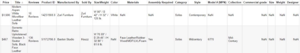
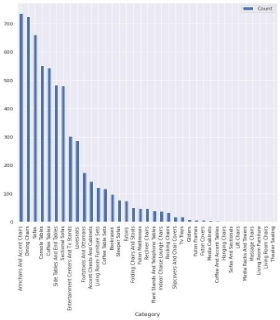
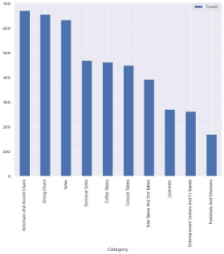
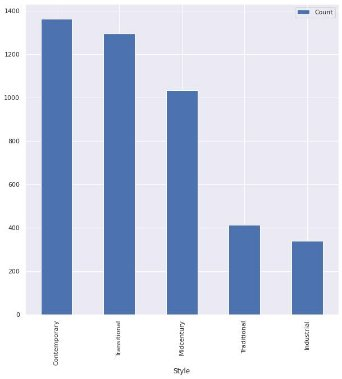
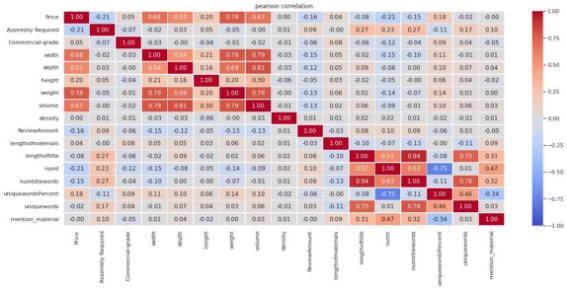
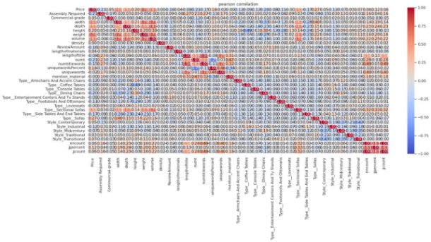
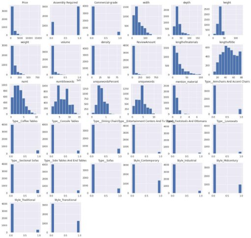
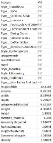
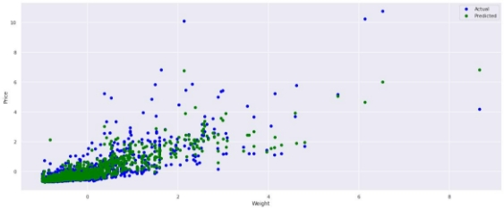
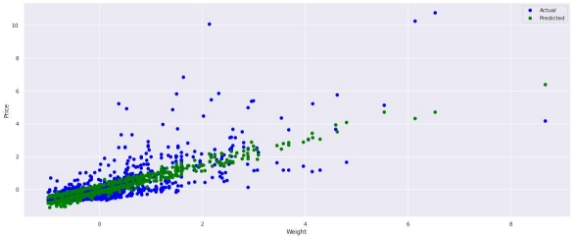

# Houzz-Modeling
Scrapped Data from Houzz.com to power predictive price models and ImageGAN Stylegan 2

**Predicting Price of Furniture Listings on E-commerce Marketplaces** Eric Martz

**Introduction:**

Over the past decade, e-commerce sales have dramatically increased as a preferred method for overall household purchases. According to a Q3 2021 report by the U.S Department of Commerce[^1], approximately 13% of all retail sales occur online, representing a staggering 500% increase from 10 years prior. As customers direct more of their purchases online, e-commerce platforms have developed a variety of online marketplaces and warehouses, offering a wider selection of products available for delivery than ever before. Due to furniture’s high material costs, shipping complexities, and the inability for customers to physically interact with the product before purchase, it has been relatively challenging for online furniture sales to grow until recently. Pandemic-related demand has stimulated unprecedented growth of e-commerce furniture sales. Previously, many traditional furniture outlets have been able to directly sell to customers from their own online catalogs. However, material shortages and technical limitations have left many retail furniture brands struggling to fully leverage their online sales capability.

E-commerce marketplaces that specialize in online furniture sales, such as Wayfair, Amazon and Houzz, have been able to use the flexibility of third-party sellers to offer customers a high level of choice and selection. These marketplaces have been much more capable of satiating online furniture sales compared to traditional retailers. E-commerce marketplaces generally connect customers to listings of products by sellers, serving to mediate the transaction and intermediate shipping processes. Unlike brick and mortar stores, e-commerce marketplaces generally do not curate items for sale, and aim for maximum selection and availability. Where a traditional brick and mortar store is limited by the square footage of their showroom, e-commerce platforms can feature a virtually unlimited amount of products. This feature, among others, makes pricing items uniquely challenging for e-commerce sellers.

In retail stores, firms select items to create a “product mix” and develop pricing strategies. Examples such as ‘bundle pricing’, ‘line pricing,’ and ‘price tiering’ create synergies to help differentiate products and maximize customer spending. On e-commerce marketplaces listings are not curated by a single seller; therefore, many pricing strategies available by traditional brands are not possible. For example, a retail furniture store may price a line of modern couches higher than a line of traditional couches in order to create a sense that a modern style represents a premium product. In a retail environment the consumer does not have the knowledge to verify if modern couches are inherently more expensive than traditional ones. However, In e-commerce marketplaces, due to the high level of product selection, price comparisons can be made easily. Since multiple sellers can list identical items, consumers are able to optimize their purchases on price.

The heightened ability of online shoppers to compare products pushes manufacturers to set prices as low as possible. However, settling on a price is still difficult due to near infinite combinations of furniture styles, materials and other design attributes. Making matters more complex is that e-commerce products also feature additional information such as reviews, product titles, and descriptions. E-commerce retailers must analyze the competition carefully, turning to statistical analysis to help with this dilemma. By using statistical techniques, a predicted price can be generated for a proposed furniture listing. With this ability, sellers can optimize furniture attributes such as materials, sizing, and style along with listing attributes such as product title and descriptions to maximize profit. This was accomplished by web scraping the e-commerce marketplace, Houzz, and fitting the data to statistical regression models in Python. New features were created from the listing data to provide attributes relating to the title’s quality. Random forest regression and linear regression were used to regress the data after it was cleaned and transformed. The best model and hyper-parameters were selected through a process of cross validation and grid search by using performance metrics R2 and adjusted R2. Applying lasso regression and analyzing model coefficients, high impact features were highlighted for business intelligence and model training.

**Background/Motivation:**

A proper product pricing strategy is essential for the business operations of any seller or manufacturer. For commodity goods such as oil and grain, and even complex goods such as flash memory, product pricing is simple. Commodities are not differentiable or influenced by marketing or personal preferences; therefore, prices are easily known by monitoring global exchanges. However, for consumer products, product pricing is much more complex. Prices of consumer goods reflect unique customer preferences and tastes. For instance, products of similar utility can be sold at vastly different price points due to branding or stylistic attributes. As a consumer good, furniture is susceptible to intricate pricing opportunities as well. However, what makes furniture unique is that it has attributes of both a commodity and a highly-differentiated good. Consumer products like phones or cars are heavily influenced by the brand name and societal popularity attached. However, furniture mainly lacks this property, being a necessity of creature comfort, but one that can be 'upgraded' to a higher quality based on aesthetics and fabrication. Furniture tends to be devoid of logos and the inherent utilitarian function of furniture cannot be copyrighted by law. Therefore, sellers and manufacturers are left with little ability to use branding to differentiate products and set prices higher.

E-commerce furniture pricing data was strictly chosen over retail data because aggregate data from multiple retailers types would fail to capture inherent differences in pricing environments, which would lower the overall accuracy of the regression. E-commerce marketplaces achieve a far more open market by comparison, and thus the pricing of goods is more closely aligned with a commodity exchange rather than a controlled environment. On e-commerce marketplaces, product differentiation exists, but mainly on the physical attribute level. For instance, on Houzz there are thousands of listings for mid-century modern dining tables, and even when details such as materials and size are filtered, variation still exists within colors, shape and product description. This blend between endless product choice and similarity presents a ripe dataset of samples that are close enough to share trends yet not too close to be completely fungible. The qualities of this dataset makes it suitable to model relationships purely between product attributes and price since aspects of marketing and other external attributes should be reduced.

Through the process of developing a regression model to predict price, insights on the relationships between listing attributes will benefit manufacturers and sellers. Mainly, the model’s performance at providing an accurate price estimate will indicate whether a profit can be made after considering material costs and manufacturing capability. This can aid manufacturers who plan to introduce a new product. Insights gained from learning the interaction between elements can help determine which attributes of a listing have the greatest effect on price. Feature engineering can enable non-numerical attributes such as the listing’s title to be learned. Similarly, categorical data can be encoded to allow the model to differentiate samples. Overall, a high quality model can provide furniture manufacturers and e-commerce sellers with the ability to optimize their listing attributes in order to make their products stand out in a highly competitive market.

**Literature Review:**

Several published sources regarding data mining and e-commerce were reviewed to gain insights on existing work and regression techniques. These papers include: *Generating E-Commerce Product Titles and Predicting their Quality*[^2]*, Show me the money! Deriving the pricing power of product features by mining consumer reviews*[^3]*, Dynamic Pricing under Competition on Online Marketplaces: A Data-Driven Approach*[^4]*, Pricing Analysis in Online Auctions using Clustering and Regression Tree Approach*[^5]*, Analyzing Target Customer Behavior Using Data Mining Techniques for E- Commerce Data*[^6]*, The Application of Data Mining in Electronic Commerce*[^7] *and Economics and electronic commerce*[^8]*.* The first three sources were pivotal in understanding the concept and are outlined in the following paragraphs.

The paper*, Generating E-Commerce Product Titles and Predicting their Quality* was completed by the eBay Core AI team, University of Seattle Washington and the Bruno Kessler Institute in Italy. The goal was to generate high quality product titles for products in any e-commerce platform. On most e-commerce marketplaces, sellers get to set the product title name for every listing. The product title appears first in search results and therefore must be carefully worded to provide detail and still retain clarity. Product titles often repeat information already available in the description of the item such as brand, size, and weight. Large sellers on e-commerce platforms may have thousands of listings and therefore successfully naming items is a burden. Many sellers result to rule-based naming schemes that result in redundant keywords in product title names. In order for the researchers to build a model capable of generating high quality titles, a method of assessing titles for quality was developed. A major aspect of product title quality was the inclusion or absence of relevant information. Relevant was defined as directly related to the product, such as brand and product type. Irrelevant information was defined by shipping type, condition, marketing terms, and price. This was considered to be related to the listing and not the actual product. 1.4 million product titles pertaining to 16,733 products were selected. A dataset of 52,050 titles for 9,823 products was hand annotated by humans, checking for a hierarchy of 22 issues in order to build a known good dataset of titles. Classifier models were built using random forests and Bidirectional Long Short-Term Memory models (LSTMs) an RNN model were considered. For the LSTM model, embeded word representations used a sigmoid activation layer to classify if a given title was good or bad. The Random forest classifier used a bag-of-words representation. To evaluate the models, an F1-score and matthew correlation coefficient was used as the main metric. The biLSTM model produced the best results with an MCC of around 10 absolute points. The methodology of determining quality of title inspired the creation of engineered features regarding product title in this dataset.

The second paper*, Show me the money! Deriving the pricing power of product features by mining consumer reviews* was developed by  researchers at  the NYU Stern School of Business. The researchers wanted to data-mine important keywords of reviews from Amazon products in order to determine what factors had the greatest impact on demand. A hedonistic model was built according to econometric theory. Hedonist products are products which can be decomposed into utilitarian characteristics, such as weight, price, materials. Therefore, items such as movie DVDs are not used due to their complex and inconsistent utility. First, product features were mined and then the reviews were mined to associate and identify sentiment on product features. A syntactic dependency was used to generate noun adjective pairs that correspond to the features of such products. Reviews from 242 products on Amazon over a 15-month period were collected. The sales ranking of each product listed was used to determine demand and the pareto distribution was used to convert the ranking data to a numeric demand level. Stanford’s NLP toolkit provided the list of frequent nouns that were attached to the part of speech in each review. For each category of product the top 30 nouns were used as the product features and were manually verified. Negative sentiment was also added into the hedonistic demand model which was regressed as a linear model. Model performance was measured using RMSE and MAE. Weights for each sentiment-product aspect pair was generated. After training the model, researchers found that somewhat positive sentiments such as ‘nice camera’ in reviews resulted in lower demand rankings. Top products contained reviews that tended to use sentiments that more ethically embraced the product such as ‘amazing camera’.

Dynamic Pricing under Competition on Online Marketplaces: A Data-Driven Approach. Sellers on e-commerce platforms frequently lower prices of goods in order to remain competitive with other sellers and raise prices quickly in order to reap in profitable situations. This constant flux of price changes makes it a challenge for sellers to properly price items especially when managing millions of products and external factors. The researchers examined existing rule-based dynamic pricing models and determined that many fail to account for the complexity of real e-commerce pricing and the needs of large sellers. Therefore, researchers at the Hasso Plattner Institute developed a dynamic pricing model that derives revised product prices by statistical regression techniques. The training dataset included dimensions, such as time, weight, price and the number of used listings, in addition to merchant-specific dimensions such as shipping costs, feedback count and sales rank. The seller-specific dimensions were included to help the model adjust to the specific seller’s needs. The model’s performance metrics were based on relative accumulated profit, revenue per sale and percent of inventory sold. Four regression approaches were tested: logistic, least squares, gradient boosted regression and multi layers perception. These regression approaches were compared on the basis of McFadden Pseudo R2. Real testing of the model used data from the Amazon Marketplace by extracting market changes for 100,000 distinct books every 2 hours. The developed model was compared to an existing rule-based model from a German Amazon merchant and was simulated to improve profits by 20%.

**Approach:**

Houzz was selected as the e-commerce platform for the data selection due to its high                  standardization of product listings and large dataset. Houzz also sorts furniture by category and lists      unique attributes such as style, which provides a feature rich extract for each piece. All the data was      scraped using the python selenium web browser library using the Chrome webdriver. HTML was parsed using the beautifulsoup library. Since the webdriver needed to interact with page elements to expose

detailed product information, it had to allow each page to fully load to extract the data. In addition, multiple checks and routine slow downs were implemented to prevent DDOS protections from Houzz. According to some reports,[^9] 21% of ecommerce traffic is by web scraper bots. Therefore, in order to extract as much data as possible in a reasonable time frame, the web scraping program was designed to run on multiple threads simultaneously in order to increase the rate of the crawl. This greatly increased the complexity of the web scraper and required custom logging and thread communications to manage the workload. The scraper went through each page of Houzz’s living room furniture library,[^10] consisting of 36 items per page for a total 100,000 items. Each item was scraped for its details, including ‘Price,’ ‘Title,’ ‘Reviews,’ ‘Model #,’ ‘Product ID,’ ‘Manufacturer,’ ‘Size/Weight,’ ‘Color,’ ‘Materials,’ ‘Category,’ ‘Style,’ ‘Assembly’ and ‘Commercial Grade.’ The scraper would save this data in a json-formatted text file. After all scrapers finished, a merging process would run, which would combine all json text files. The following is a sample of the extracted and unprocessed data.

The first step of data cleaning started with parsing out pricing information, height, weight and depth details from the given text based format into pure numerical qualities. Weight in kilograms and dimensions in centimeters were converted into pounds and inches. The quantity of reviews was also converted to a numerical amount. A standard z score scaling was applied to the dataset when using lasso regression. Out of the 40,000 items of furniture collected, only 6512 had unique information. Duplicates were identified by matching product ID and price. If the same product was sold at the same price and title name, they were merged into one. Some of the duplicates were a result of the multiple drivers reading the same page in the web scraping process. Due to Houzz’s enforcement of data for price, title and other details, no missing data was found regarding those fields. However, descriptive elements, such as the “materials” field were optional. When missing, those were assumed to be blank intentionally by the seller. Blanks for optional descriptive fields accounted for 8% of the dataset. The ‘Designer’ field was blank for 98% of all samples and therefore the feature was dropped.

All data collected was from the living room furniture section of Houzz’s products. In total, products came from 37 unique categories. These categories range from common items, such as “Sofas,” to more niche categories, such as “Massage Chairs.” In order to ensure the dataset was comprised of categories that had sufficient samples, categories that had fewer than the median number of samples in a category were removed. For instance, some categories had no more than 18 items (slipcovers and chair covers). A similar process was applied for the style attribute. Overall, 19 styles were collected and reduced to 4, after removing obscure and low represented ones. This step was important in reducing the amount of categorical data that would need to be encoded. Fields that could not be used for feature engineering or regression were also removed. After using ‘Product ID’ and ‘Model #’ for duplication lookup, it was removed since it did not appear to have any recognizable patterns to extract additional features. The following tables showcase some of the data exploration and filtering steps regarding furniture category and style.

|
Quantity of Samples per category before reduction:

Figure 1
|
Quantity of samples per category after reduction:

Figure 2
|
| - | - |
|

Figure 3
|

Figure 4
|

|

Figure 5
|

Figure 6
|
| - | - |

In order to find outlier data points that may be a result of erroneous data entry, samples that exceed price or physical size expectations for a given category were found. This was done on a categorical level due to the variation of the distributions of price and size and for each category of furniture. For instance, the mean price for a coffee table was found to be $644.24 and for sofas it was $1,907.87. The mean and standard deviation was calculated for price and volume for each category and points that lie beyond 3 standard deviations were removed. These items appeared to be listed by sellers with erroneous values, a sometimes intentional practice that some sellers engage in when they wish to keep listings open while they lack inventory or automatically set due to faulty dynamic pricing models. This phenomenon has been reported in e-commerce marketplaces such as Wayfair and Amazon[^11]. After these erroneous datapoints are removed visuzalitions regarding features can be interpreted more efficiently.

To visualize the effect of style on price, a boxplot of each style was created from only sofa listings in figure 7. It was necessary to exclude all other furniture categories to remove the effects of categorical differences. Figure 5 illustrates how the distribution of styles is not consistent among categories, and therefore, without filtering down to a single style, this unequal distribution would reflect in the average prices. Figures 7 and 8 appear to suggest that there is an effect between style and price and category and price. To further investigate this, a two-way Anova test was performed between style and category and the interaction between them. Figure 9 shows the results of the Anova test. Each term had a p-value less than 0.05 and is subsequently significant. Therefore, a furniture’s category, style and price appears to have a statistically significant effect on price.

|

Figure 7
|

Figure 8
|
| - | - |

|

Figure 9
|

Figure 10
|
| - | - |

The furniture’s style and ‘category’ are represented by discrete strings and must be preprocessed into numerical values. Therefore, a furniture listing’s ‘style’ and ‘category’ was encoded using “one hot encoding” for each unique style creating new attributes: ‘Style\_Contemporary,’ ‘Style\_Industiral,’ ‘Style\_Midcentury,’ ‘Style\_Traditional,’ and ‘Style\_Transitional.’ ‘Assembly Required’ was encoded as a 0 or 1 if true, ‘Commercial-grade’ was encoded similarly. Furniture categories (coffee tables, sofas, etc.) were encoded in the same way. In order to test the combined effect of an item’s dimensions (width, depth and height), volume was calculated by simply multiplying the attributes. Given that weight information was also extracted, the furniture's density can be found by dividing the weight by the calculated volume. To evaluate the effects of the listing’s title on price, a metric to quantify aspects of the title were engineered. De Souza, José GC et al, used a method to evaluate the effectiveness of a product title’s quality based upon a rule set. An important finding was the inclusion of information in the title that is either non-specific to the product or is repeated in the product’s description. Similarly, a common natural language processing technique, inverse document frequency is commonly used to gauge a words importance compared to words used across all documents.[^12] The metric used in title quality research was term frequency from the title in the description. To simulate this, a similar field was calculated that counted the number of times a title word is contained in the descriptive fields of the product. For instance, a title for a coffee table might say “Bright Green Quartz Coffee Table,” where the color green may be already mentioned in the colors field, ‘quartz’ may exist in the materials fields and ‘Coffee Table’ may exist in the category field. Therefore, 4 out of 5 words (80%) in the title can already be found in the descriptive fields. In order to create this metric, first the number of words was found in each title and saved into the feature column ‘numtitlewords.’ Then each word in the title was searched in the sample’s other text fields to check for matches. The number of matches was placed into column ‘numt.’ Lastly, the final metric ‘uniquewords’ can be calculated as the percentage  (‘numtitlewords‘ - ‘numt’) / ‘numtitlewords’. Therefore, ‘uniquewords’ was able to express the percentage of the words in the title that are not found anywhere else in the listing. The last calculated feature to help determine title quality involved using the Python natural language toolkit library ‘nltk.’ The library includes a function that is able to determine the part of speech of a given word. This was used to count the number of adjectives in each listing’s title as ‘jjcount.’ This was also then calculated as a percentage of total words by dividing ‘jjcount’ by ‘numtitlewords’ and saved as ‘jjpercent.’ This feature was created to observe the effect of word choice on listing price. Since all the listings are for furniture, which are nouns in English, adjectives would then be included to provide detail in the title.

Another engineered column was created to determine the number of times a material was mentioned in the product’s title. Since furniture is sat on and touched regularly, the quality and appearance of the materials are generally of high concern for customers. A genuine marble table would in theory cost more than one made of plywood. When customers search for a furniture item, it is not uncommon to include the material in part of the search such as “Leather Couch.” Knowing how materials affect price when included in the product title is of relevance to sellers and manufacturers. Knowing when not to include a material is also important as well. For instance, medium-density fibreboard (mdf) is a synthetic wood composite used in many flat packed and low cost furniture items and is also commonly used for structural purposes in furniture. Due to its low cost and unappealing appearance, it would seem it would be a negative aspect to mention in the product’s title. Therefore, feature ‘mention\_material’ was calculated to see the number of times a material was mentioned in a given product’s title. To complement the descriptive features, the title’s character length and description character length was added as well.

Results:

Cleaning and reducing the dataset’s original features resulted in a dataset containing 32 numerical attributes to regress on. These included 5 originally numerical, 10 encoded furniture categories, 5 encoded furniture styles and 12 calculated fields. The following 2 figures are the Pearson correlation matrix of the dataset. In order to visualize many aspects of that datasets quickly, a histogram for each attribute is provided.

|

Figure 11
|
| - |
|

Figure 12
|

Figure 13

From the correlation table, it becomes clear that many of the calculated fields are highly correlated. This is due to the fact that attributes such as ‘width’ and ‘depth’ are directly used to calculate features such as volume. Therefore, in order to prevent multicollinearity error, these highly correlated attributes should be removed. In addition, the variance inflation factor (VIF) was tabulated for each category in Table 1. VIF measures the ratio between a model where the attribute is not included in a model and a model where the attribute is the only variable. A VIF greater than 10 is considered to have significant risk of multicollinearity. From the resulting table, many attributes exceed a VIF greater than 10.

To find another way in determining which attributes should stay, the entire selection was fitted using lasso regression. A grid search was performed to optimize adjusted R2 by changing values for the penalty parameter ‘λ’. In addition, 5 fold cross validation was performed for all models. Python does not natively support adjusted R2, and therefore a custom scorer was created to calculate adjusted R2. The formula for adjusted R2 is as follows:

Adjusted R2 was selected due to its ability to factor in the number of independent regressors ‘k’ parameters used. ‘K’ was determined by the number of coefficients in the lasso regression above zero. Unadjusted R2 tends to increase with more regressors and therefore can tend to include unnecessary features. After 1000 steps, the highest R2 and adjusted R2 was found for the dataset. What is notable is that the optimal penalty is higher when solving for adjusted R2.

|Lasso Alpha|Mean R2|Mean Adjusted R2|
| - | - | - |
|0\.00900|0\.65677|0\.651600|
|0\.00909|0\.65513|0\.6528402|
|0\.03|0\.64740|0\.64540|
|0\.05|0\.6374|0\.6358|
|0\.1|0\.6130|0\.6116|
|0\.5|0\.327645|0\.32718|
|1|-0.037412|-0.037456|

Table 2

The following bar chart illustrates the optimal adjusted R2 model’s coefficients for each parameter. The same dataset was also applied to a random forest model in which parameters were tuned via random searching to have a minimum sample split of 4. The second bar chart illustrates the random forest's model total gini impurity for each feature as a percentage.

|

Figure 14

Lasso Model: R2 0.6528402 MSE: 0.39107149
|

FIgure 15

Random Forrest: R2 0.8005 MSE: 0.2086
|
| - | - |

Lasso regression resulted in 5 attributes minimized to zero. Observing both figures indicate that ‘weight,’ ‘volume,’ ‘assembly required,’ and ‘ReviewAmount’ have high importance in predicting price. Therefore, these features may be indicative of high importance overall. Rebuilding the model using lasso regression and random forest with only features listed in the top 4 importances resulted in the following table after 5 fold cross validation.

|Model|R2|MSE|MAE|
| - | - | - | - |
|Lasso Linear Regression|0\.61317|0\.40594|1\.4463|
|Random Forrest|0\.77179|0\.27479|1\.7195|

Table 3

Even with only 4 attributes, the model’s performance did not dramatically reduce. The impact of weight still seems to carry the most importance. Due to features such as price and weight varying significantly between categories, it is also possible to train separate models for each furniture category. This would potentially result in higher R2 in training, but also may increase model overfit. The dataset was split up by category and individual linear regression models were created on each using the same attributes. Then the same train, a  test split, was used to compare the predicted values from the individual model to the model trained with all the categories. The following table shows the resulting R2 for each after testing.

|Category|Individual Linear Regression R2|Category R2 on mixed MLR model|Category R2 on mixed Random Forrest|
| - | :- | :- | - |
|Armchairs And Accent Chairs|0\.411|0\.4468431886|0\.4878816951|
|Coffee Tables|0\.55|0\.3610708551|0\.5833962114|
|Console Tables|0\.56|0\.6582594817|0\.6134830005|
|Dining Chairs|0\.107|-1.20722312|-0.08456064282|
|Entertainment Centers And Tv Stands|0\.622|0\.6350527479|0\.7799680306|
|Footstools And Ottomans|0\.388|-0.7287260488|0\.5553691457|
|Loveseats|0\.275|0\.5145829219|0\.4922692776|
|Sectional Sofas|0\.363|0\.3817040128|0\.5337163322|
|Side Tables And End Tables|0\.415|-1.248484477|0\.4667727495|
|Sofas|0\.418|0\.2948446351|0\.4536347379|

Table 4

The results indicate that building separate models for each category seemed to have either slightly improved performance or worsened performance. The average change in R2 from testing on the mixed trained MLR model and individual MLR was -0.4%, and therefore the results suggest that training on the smaller dataset resulted in an overfitted model.

By plotting true values against predicted values, the effectiveness of the model’s ability to capture the relationship can be visualized: a perfectly fitted model with results in a perfect linear line where predicted values of price = true value of price. The following 4 figures are related to the best fitted random forest model and lasso regression models with the attributes used in Table 3. Both models were tested and trained using the same splitted dataset. In Figure 18, the majority of the predicted values lie above the ideal, which indicates that the lasso regression model tends to overestimate price due the price in the testing dataset. Figure 19 plots the kernel density estimate of the residuals for lasso regression and indicates a large tail in the upper bounds. This indicates that high bias of the underlying linear model of lasso regression is failing to capture trends in the data.

|

Figure 16 - Random Forest
|

Figure 17 - Random Forest
|
| - | - |
|

Figure 18 - Lasso Regression
|

Figure 19 - Lasso Regression
|

To illustrate how lasso linear regression may not be fitting the data properly, plots between tested values and predicted values of the model are generated. For the x axis, weight of the given test data point is used, due the high positive correlation between price and weight. In this way, the graphs should visualize higher price points as weight increases. The resulting Figures 20 and 21 appear to indicate that for large values of weight price appears to increase in a nonlinear fashion.

|

Figure 20 - Random Forest
|
| - |
|

Figure 21 - Lasso Regression
|

Discussion

From the testing it appears that random forest regression consistently performs better than lasso/linear regression. This can be explained by random forest's ability to better fit nonlinear relationships as well as overfit training data overall. Given the same attributes and training data, random forest is able to achieve, on average, an R2 value of 10% greater than the lasso regression. When comparing lasso regression and random forest regression when building and testing models by category, random forest also achieved a higher R2 value for most instances.

Calculated features, such as ‘numt,’ ‘titlelength,’ and ‘materials\_present’ did have a significant effect, although small, on a model’s ability to predict price. Weight was still consistently the most important feature across all models. This can be partly explained by the relatively low deviation of density across all categories. Weight also increases shipping costs and since most items listed include free shipping, freight costs must be factored into the overall cost. In addition, expensive materials such

as granite, brass and hardwood tend to weigh more than cheaper alternatives. Volume is also highly correlated with price, which is understandable as a large size requires more material and higher shipping costs. In order to examine how a model would perform without any direct knowledge of weight and size information, a random forest regression model without any attributes volume, width, depth, height, density and weight was regressed. Results in figure show the following feature based on gini importances:

This model has a mean R2 of 0.6764, which is a 13% decrease compared to the best performing random forest model in table 3. It seems that ‘Type\_\_Sectional Sofas’ and ‘Type\_\_Sofas’ have the highest splitting ability in this model when attributes related to weight and size are removed. This is likely caused by the fact that sofas and sectional sofas listings have the highest median weight and price. Therefore, these encoded categories effectively split samples into high/low weight classes and essentially replace the ‘weight’ feature in the previous model. As a result, other engineered features such as “ReviewAmount,” ‘lenghtoftitle,’ and ‘lengthofmaterials’ are able to rise in overall feature relevance.

It is interesting to note from the correlation table that ‘assembly required’ has a negative effect (-0.21) on price and ‘commercial-grade’ has a slight positive correlation with price of 0.05. These observations align with the assumption that assembled furniture may be flat packed which requires effort from the consumer and in turn presents cost savings in the price. Listings that require assembly are also highly correlated with title length (0.27) which may suggest that sellers tend to add lengthy explanations to warn customers of the assembly process. Commercial grade’s modest interaction with price does not seem to indicate significant predictive ability. In addition, commercial-grade is not strongly correlated with weight, volume or description of materials in title (‘mention\_material’). Therefore, it appears that listings that feature commercial-grade as true do not have any significant adaptations that make them more suitable for commercial-use. ‘Uniquewordspercent’ and ‘jjpercent’ both have positive correlation with price of 0.18 and 0.12, respectively. However, both attributes do not appear to share a correlation with each other. Attributes ‘lengthoftitle’ and ‘numtitlewords’ also correlate negatively with price (-0.8, -0.15). ‘jjpercent’ also has a very weak correlation with ‘numtitlewords’ and ‘numt’, which seems to suggest that “jjpercent” is not simply correlated with large titles and lengthy descriptions and is able to correlate some aspect of price. However, this is speculative because it was not shown to provide great predictive power when building the models.

Conclusion:

Determining a given furniture listing price on Houzz appears to be feasible at reasonable levels of accuracy. The results show that the most effective way to regress on price is to include all categories and styles in the training data. Random forest regression proved to be the most effective model but can be more susceptible to overfitting if multi correlated features are not dropped in preprocessing. Since lasso regression reduces feature weights coefficients and was also tuned on the basis of adjusted R2, it is trained to have low bias and is subsequently less susceptible to overfitting. However, when exploring model residuals it becomes clear that a linear relationship between weight is not constant and therefore lasso regression struggles to remain accurate for values that have large weights.

By utilizing more advanced natural processing libraries methods, potentially word embedding, better analysis can be done regarding the effects between materials and price. Further expansion can be done with the existing NLTK library to examine the effects of more parts of speech, as only adjectives were analyzed in the product title. The NLTK library is capable of classifying 35 parts of speech. In addition, greater statistical analysis can be done on the distributions of those parts of speech across all descriptive text fields. Advanced attempts at feature engineering title attributes failed to result in strong predictive ability and its effect may only attribute to a small level of price regardless of the methods used.

In the preprocessing steps, instead of dropping categories and styles that were underrepresented, some could have been better off being merged with larger categories. For instance, the style ‘scandinavian’ could have been merged with ‘contemporary’ since many furniture pieces labeled as scandinavian may be also considered as a subset of contemporary or modern furniture. Applying more merging techniques would therefore allow a greater number of samples to be incorporated into the overall dataset. However, merging categories without statistical comparisons relies on assumptions that may be false and harmful. Feature engineering can produce lots of intermediate features which can be highly correlated. Since each step could provide a useful statistic it can be tempting to include all attributes.

The data collection process can also be expanded to collect additional information. By running the web scraper on a regular basis, the dataset can add time collected as an attribute. With this field, the dataset could be used to find changes in pricing for various items and serve as the basis to train a dynamic pricing model. In addition by scraping more ecommerce platforms discoveries in potential pricing disparities can be found. Other e-commerce platforms also have the ability to sort items by sales rank, which can either be used as a metric to determine demand with the pareto distribution technique found in paper 2. Review count was the only metric collected related to reviews; however, the webscraper can be improved to extract each review response for a listing. The reviews could help provide greater insight on product sentiment and highlight customer feedback.

The Python library, ‘scikit learn,’ provided the regression models random forest regression and lasso and linear regression. The library offers more regression models, such as gradient boosting and principal components regression, which could also be tested and compared for further insight. Additional error terms can be evaluated such as median absolute error which is more robust to outlier points. More complicated neural network models could also be trained as tested. Overall, there is a wide range of directions to expand the scope of this work and the ground work proves that some kind of predictive ability can exist.

[^1]: United States, Department of Commerce, “Quarterly Retail E-Commerce Sales 3rd Quarter 2021” Nov. 2021, <https://www2.census.gov/retail/releases/historical/ecomm/21q3.pdf>
[^2]: de Souza, José GC, et al. "Generating e-commerce product titles and predicting their quality." Proceedings of the 11th International Conference on Natural Language Generation. 2018.
[^3]: Archak, Nikolay, Anindya Ghose, and Panagiotis G. Ipeirotis. "Show me the money! Deriving the pricing power of product features by mining consumer reviews." Proceedings of the 13th ACM SIGKDD international conference on Knowledge discovery and data mining. 2007.
[^4]: Schlosser, Rainer, and Martin Boissier. "Dynamic pricing under competition on online marketplaces: A data-driven approach." Proceedings of the 24th ACM SIGKDD international conference on knowledge discovery & data mining. 2018.
[^5]: Kaur, Preetinder, Madhu Goyal, and Jie Lu. "Pricing analysis in online auctions using clustering and regression tree approach." *International Workshop on Agents and Data Mining Interaction*. Springer, Berlin, Heidelberg, 2011.
[^6]: Bhate, Dattatray V., and M. Yaseen Pasha. "Analyzing Target Customer Behavior Using Data Mining Techniques for E-Commerce Data." *International Journal of Innovative Research in Computer Science & Technology* 2.1 (2014): 16-19.
[^7]: Chen, Ying. "The Application of Data Mining in Electronic Commerce." Advances In Computer Science Research (ACSR) 76 (2017): 1017-1020.
[^8]: Borenstein, Severin, and Garth Saloner. "Economics and electronic commerce." *Journal of Economic Perspectives* 15.1 (2001): 3-12.
[^9]: Rahman, Rizwan Ur, and Deepak Singh Tomar. "Threats of price scraping on e-commerce websites: attack model and its detection using neural network." *Journal of Computer Virology and Hacking Techniques* 17.1 (2021): 75-89.
[^10]: https://www.houzz.com/products/living-room-furniture
[^11]: Morris, David Z. “Here's What Causes Crazy Prices on Wayfair and Amazon.” Fortune, Fortune, 15 July 2020, https://fortune.com/2020/07/14/wayfair-cabinet-conspiracy-algorithm-amazon-pricing-ecommerce/.
[^12]: Manning, Christopher D., et al. “Inverse Document Frequency.” Introduction to Information Retrieval, Cambridge University Press, Cambridge, 2018.
